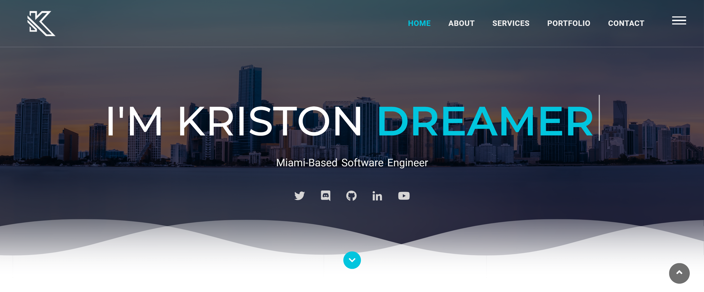
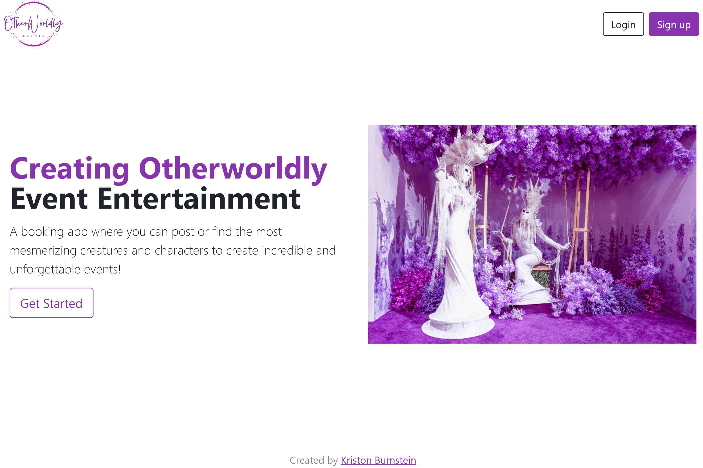

<!-- Banner -->

<!-- Typing Text -->

    

<!-- SOCIALS -->
 

  

    
    
    
    
  

<!-- ABOUT ME -->

<h2 align="center" color="white">About Me</h2>

Hi there! I'm Kriston, a Miami based Software Engineer passionate about education and tech with an interest in AI and Machine Learning. I leverage an artistic background to create functional beauty for engaging and performant full stack web applications. I operate with empathy, believe in community, and strive to convey kindness. Always interested in do-gooder people, projects, and companies. Let's connect!

<!-- 

  

 -->

 
 

<!-- Languages and Tools -->
 
<h2 align="center" color="white">Languages and Tools</h2>

MERN Stack | JavaScript, React, Express, Node, MongoDB

<!-- Github Stats -->
    
<!-- 

 -->

<!-- 

 -->
 
 
 

<!-- My Work -->

<h2 align="center">My Work</h2>
<table bordercolor="#66b2b2">
  <tr>
    <td width="50%" valign="top">
        <h3 align="center">Parkside Paradise Virtual Walks</h3>
         
        
         
        

              
            	
        

        
<strong>Full Stack CRUD app using MVC architecture with EJS, JavaScript, CSS, Bootstrap, Node.js, MongoDB, Mongoose, Express.js, and Cloudinary</strong> - Curated immersive virtual walks from YouTube Guides through US National Parks. You're invited to relax, unwind, and experience the splendor of some of the US's most mesmerizing landscapes.

    </td>
    <td width="50%" valign="top">
        <h3 align="center">Otherworldly Event Booker</h3>
         
        
         
        

              
            	
        

        
<strong>Full Stack CRUD app, MVC architecture, JavaScript, EJS, Bootstrap, CSS, Node.js, Express.js, Cloudinary, MongoDB</strong> -  (MVP) A booking app where you can post or find the most mesmerizing creatures and characters to create unforgettable events! Allows users to log in, bookmark, save, and like their favorite characters, and upload their own characters.

    </td>
  </tr>  
  <tr>
    <td width="50%" valign="top">
        <h3 align="center">Matty Z Photography</h3>
         
        
         
        

              
            	
        

        
<strong>Javascript, PHP, HTML5, CSS, Bootstrap 5</strong> - An interactive online showcase of the service offerings from a young adventurous local photographer, featuring all kinds of fun little bells and whistles for visitors to play with on the site. 

    </td>
    <td width="50%" valign="top">
        <h3 align="center">Amelia Everly Cruises</h3>
         
        
         
        

              
            	
        

        
<strong>HTML5, CSS, and SASS</strong> - A fully responsive, simple yet beautiful and modern business card website with a South Florida flavor for a Port of Miami based Cruise Consultant, featuring button animations and a moving wave. 

    </td>
  </tr>
</table>

 
 

<!-- SOCIALS -->
 
<h2 align="center" color="white">Connect with Me</h2>

  

    
    
    
    
  

<!--
**kriston-burnstein/kriston-burnstein** is a ✨ _special_ ✨ repository because its `README.md` (this file) appears on your GitHub profile.

Here are some ideas to get you started:

- 🔭 I’m currently working on ...
- 🌱 I’m currently learning ...
- 👯 I’m looking to collaborate on ...
- 🤔 I’m looking for help with ...
- 💬 Ask me about ...
- 📫 How to reach me: ...
- 😄 Pronouns: ...
- ⚡ Fun fact: ...

-->
